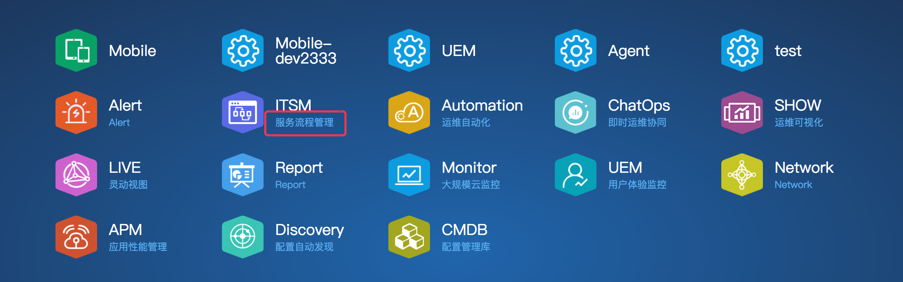
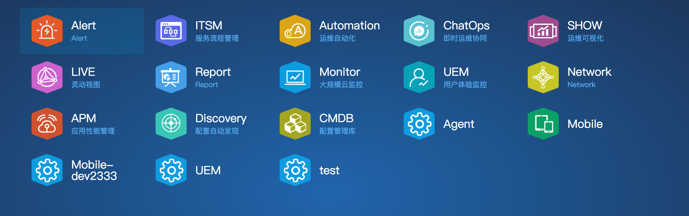
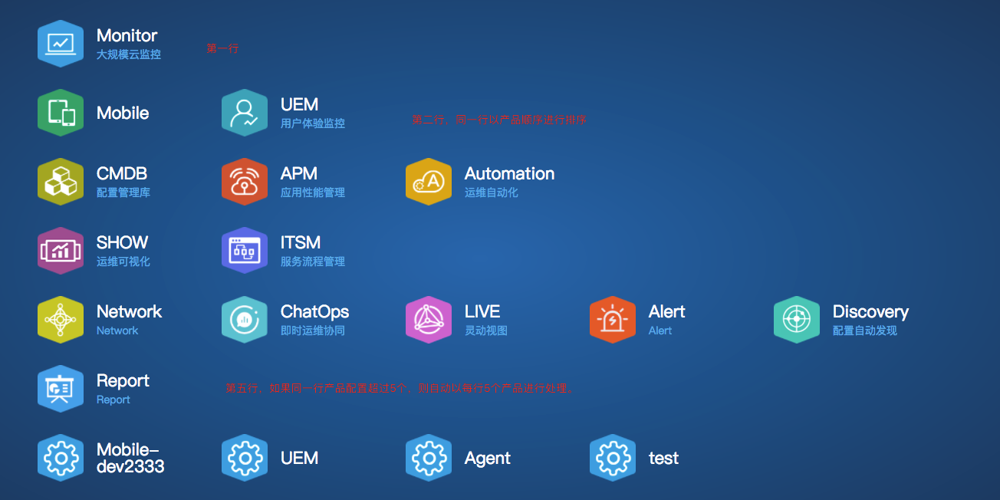

# 产品配置修改指南

# R10版本及以后产品配置修改指南

## 目标
由于部分企业有修改产品描述，排序以及想要分行(分类)的需求，现将描述，排序和分行配置与disconf中，后续有现场人员根据情况自行修改，修改完之后，请调用[产品redis清空接口](#产品redis清空接口)，刷新产品redis信息。

---

## 要求
以下所有配置信息都需要修改在**tenant.properties**文件中。  
且对应到各个产品的productNum，[详情请见各产品信息对应kb](http://www.uyunsoft.cn/kb/pages/viewpage.action?pageId=13632808)，且更新之后需要手动[刷新redis信息](#产品redis清空接口)。  
**注意**  
**租户的产品列表页面展示各产品时，会优先分行(分类)，再在同行(类)上根据排序配置进行排序，然后再以产品注册时间顺序排序。  
未配置分行的产品将放在最末行，未配置排序的产品将放在末位。**

---

## 步骤
1. 选择对应修改操作（描述操作，排序操作，分行操作）。
2. [刷新redis信息](#产品redis清空接口)**（必须调用）**。

---

## 具体操作
### 描述操作
产品下面的说明，不同语言有不同的描述说明，请根据情况配置。

**(如果没有英文描述可以不写tenant.product.description.en_US配置信息)**

```
## 格式说明，下面lang需要替换成对应的语言(productNum,description 中间以分号隔开)
tenant.product.description.lang=productNum1,description1;productNum2,description2;
```

```
例:

## 中文描述
tenant.product.description.zh_CN=1001,大规模云监控;1002,用户体验监控;1004,配置管理库;1005,运维自动化;1006,应用性能管理;1007,运维可视化;1008,服务流程管理;1009,大规模网络监控;1010,即时运维协同;1011,大规模视频监控;1012,灵动视图;1013,集中告警管理平台;1014,配置自动发现;1015,报表分析系统
  
## 英文描述(自行补充)
tenant.product.description.en_US=1001,monitor;1002,UEM;1004,cmdb;1005,automation;1006,apm;1007,show;1008,ITSM;1009,Network;1010,ChatOps;1011,VideoMon;1012,Live;1013,Alert;1014,Discovery;1015,Report

```



### 排序操作
在产品列表页面可以自行修改产品排序,调整产品显示顺序。  

**如果不配置，默认以产品注册时间的倒叙进行排序。**   
**如果相同的顺序，则也是按照产品注册时间进行排序。**  
**如果部分产品配置，部分产品未配置排序的情况，优先以配置的顺序进行排序，然后未配置的产品以默认方式进行处理。**     


```
## 格式说明productNum,orderby 中间以分号隔开
tenant.product.orderby=productNum1,orderby1;productNum2,orderby2;
```
```
例:
## 产品排序
tenant.product.orderby=1013,1;1008,2;1005,3;1010,4;1007,5;1012,6;1015,7;1001,8;1002,9;1009,10;1011,11;1006,12;1014,13;1004,14;1111,15;
```



### 分行(分类)
将各个产品进行分行(分类)处理，即将制定的产品放在同一行，请根据实际情况自行修改。

**如果不配置，默认以每行5个产品排序。**  
**如果同一行超过5个产品，也将自行进行分行。**


```
## 格式说明productNum,type 中间以分号隔开
tenant.product.type=productNum1,type1;productNum2,type2;
```
```
## 产品分行(分类)
tenant.product.type=1001,1;1002,2;1003,2;1004,3;1005,3;1006,3;1007,4;1008,4;1009,5;1010,5;1011,5;1012,5;1013,5;1014,5;1015,5;
```




## 产品redis清空接口
disconf中修改以上任一配置之后，需要情况产品的redis信息，请调用接口，然后再次刷新页面即可。

```
## 产品redis刷新接口
IP/tenant/api/v1/product/delpredis
```

