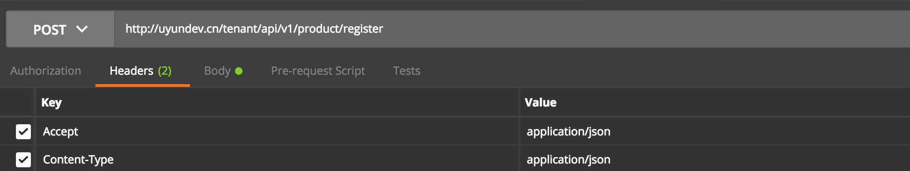
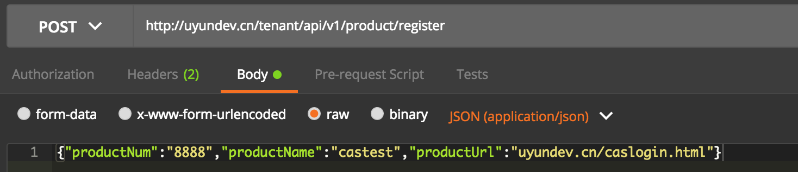
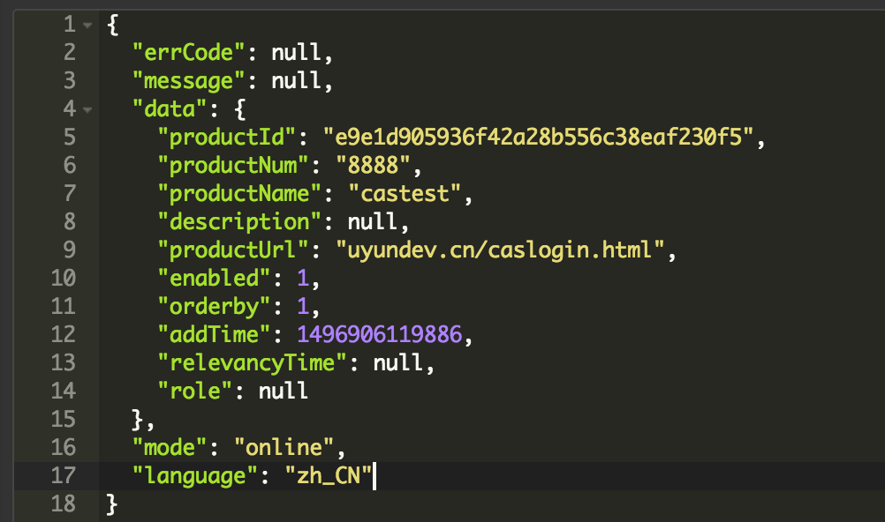
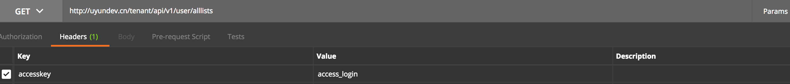
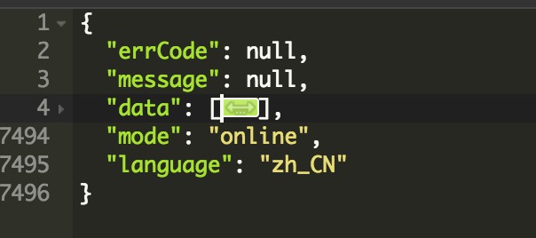
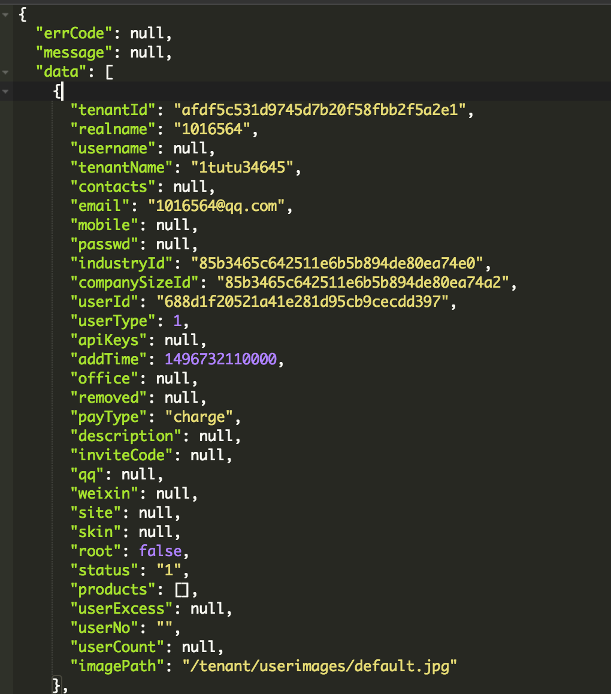
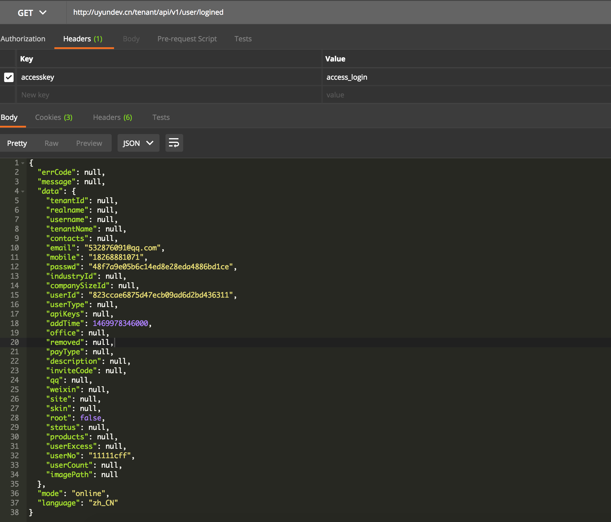

# 第三方产品接入租户API说明
---

* [涉及到租户的接口说明](#涉及到租户接口说明)
	* [产品注册](#产品注册)
	* [所有用户信息列表](#所有用户信息列表)
	* [获取当前登录用户信息](#获取当前登录用户信息)

---

# 涉及到租户接口说明
## 产品注册
将第三方产品注册到租户中来,当做单点登录的一个入口

**rest方式请求(POST)**  
用rest方式请求的时候,参数必须为json格式  

> 方法url:ip:port/tenant/api/v1/product/register

**dubbo方式请求**

> 方法:ProductService.save(Product product)

**参数说明**

参数名称 | 类型 | 是否必须 | 说明 |
--- |--- | --- | --- | 
productNum | String | 是 | 产品编号(产品编号不能与现有产品一样,请从110X开始注册) |
productName | String | 是 | 产品名称 |
productUrl | String | 是 | 产品url(此处请填写nginx配置过之后的中间页面地址) | 
description | String | 是 | 产品描述 |

Rest请求示例:  
  
  

**返回结果**  

## 所有用户信息列表
获取所有用户(包括租户)的所有信息,但不包括产品数据

**特别说明：**  
**该接口请求的时候，需要将token放在cookie中。**

**rest方式请求(GET)**  
用rest方式请求的时候,参数必须为json格式  

> 方法url:ip:port/tenant/api/v1/user/alllists

**dubbo方式请求**

> 方法:UserService.listAllUserInfo(String accessKey)

**请求参数**

参数名称 | 类型 | 是否必须 | 说明 |
--- |--- | --- | --- | 
accessKey | String | Dubbo接口必须,rest接口放入头部header中 | 允许访问的key(正确的key需要在disconf中进行设置)|

Rest请求示例:
  

**返回结果**   
  
  

## 获取当前登录用户信息
获取当前登录用户的账号(email,mobile,userNo)和密码(passwd)信息

**特别说明：**   
**该接口请求的时候，需要将token放在cookie中。**

**请求方式(GET)**  
该方法只允许rest方式访问,且必须在请求的header加入accessKey参数

> 方法url: ip:port/tenant/api/v1/user/logined

**返回结果**  
只返回对应的账号(email,mobile,userNo)和密码(passwd)信息

